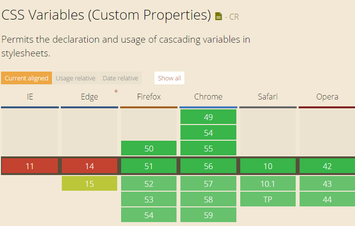

# css3基础知识

总结平时遇到的css3基础知识

## flex弹性布局
见[flex-layout](https://github.com/lirumeng/flex-layout)

## calc()函数
使用[`calc()`函数](./demos/calc().html)计算`<div>`元素的宽度
```css
#div1 {
    position: absolute;
    left: 50px;
    width: calc(100% - 100px);
    border: 1px solid black;
    background-color: yellow;
    padding: 5px;
    text-align: center;
}
```

### 定义与用法
`calc()` 函数用于动态计算长度值。
* 需要注意的是，运算符前后都需要保留一个空格，例如：`width`: `calc(100% - 10px)`
* 任何长度值都可以使用calc()函数进行计算
* `calc()`函数支持 `"+"`, `"-"`, `"*"`, `"/"` 运算
* `calc()`函数使用标准的数学运算优先级规则

### CSS 语法
```css
calc(expression)
```

`expression` 一个数学表达式，结果将采用运算后的返回值

## css变量var
悲催的是，IE11都不兼容/(ㄒoㄒ)/~~
