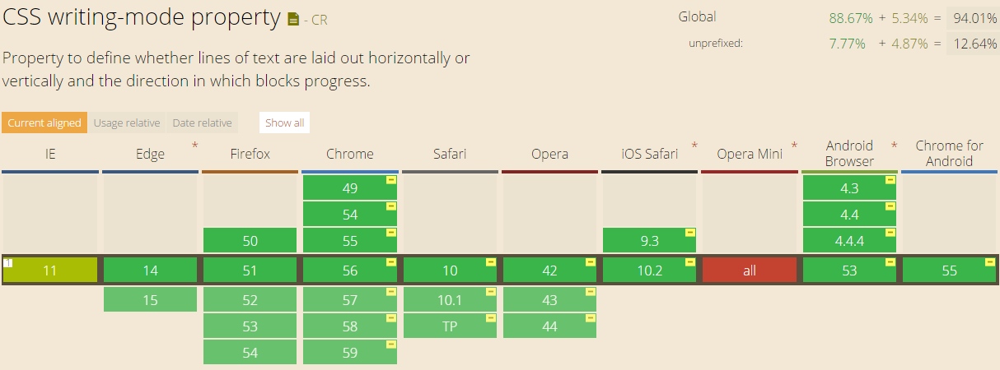
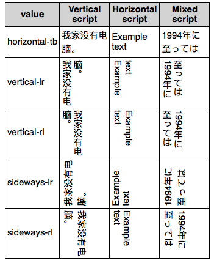

# css3基础知识

总结平时遇到的css3基础知识

## flex弹性布局
见[flex-layout](https://github.com/lirumeng/flex-layout)

## calc()函数
使用[`calc()`函数](./demos/calc().html)计算`<div>`元素的宽度
```css
#div1 {
    position: absolute;
    left: 50px;
    width: calc(100% - 100px);
    border: 1px solid black;
    background-color: yellow;
    padding: 5px;
    text-align: center;
}
```

### 定义与用法
`calc()` 函数用于动态计算长度值。
* 需要注意的是，运算符前后都需要保留一个空格，例如：`width`: `calc(100% - 10px)`
* 任何长度值都可以使用calc()函数进行计算
* `calc()`函数支持 `"+"`, `"-"`, `"*"`, `"/"` 运算
* `calc()`函数使用标准的数学运算优先级规则

### CSS 语法
```css
calc(expression)
```

`expression` 一个数学表达式，结果将采用运算后的返回值

## 原生的CSS变量
悲催的是，IE11都不兼容/(ㄒoㄒ)/~~


demo:
[css变量var](./demos/css_var.html)

### CSS变量var()语法和用法和特性
CSS中原生的变量定义语法是：`--*`，变量使用语法是：`var(--*)`，其中`*`表示我们的变量名称。关于命名这个东西，各种语言都有些显示，例如CSS选择器不能是数字开头，JS中的变量是不能直接数值的，但是，`在CSS变量中，这些限制通通没有`，例如：
```css
:root {
  --1: #369;
}
body {
  background-color: var(--1);
}
```
结果背景色如下：


但是，不能包含`$`，`[`，`^`，`(`，`%`等字符，普通字符局限在只要是`[0-9]` `[a-zA-Z]` `_`和`-`这些组合，但是`可以是中文，日文或者韩文`，例如：
```css
body {
  --深蓝: #369;
  background-color: var(--深蓝);
}
```

注意：无论是变量的定义和使用只能在声明块`{}`里面，如下写法是无效的：
```css
--深蓝: #369;
body {
  background-color: var(--深蓝);
}
```

变量的定义，或者说声明跟CSS计数器的声明类似的，你应该摆脱`Sass/Less`等预编译工具语法先入为主的语法影响，把CSS的原生变量理解为一种CSS属性。这样，你就对其权重和变量应用规则要容易理解地多。
例如下面这个例子：
```css
:root { --color: purple; }
div { --color: green; }
#alert { --color: red; }
* { color: var(--color); }
```
```html
<p>我的紫色继承于根元素</p>
<div>我的绿色来自直接设置</div>
<div id='alert'>
  ID选择器权重更高，因此是红色！
  <p>由于继承，我也是红色</p>
</div>
```
上面这个例子我们可以获得这些信息：
* 变量也是跟着CSS选择器走的，如果变量所在的选择器和使用变量的元素没有交集，是没有效果的。例如`#alert`定义的变量，只有`id`为`alert`的元素才能享有。如果你想变量全局使用，则你可以设置在`:root`选择器上；
* 当存在多个同样名称的变量时候，变量的覆盖规则由CSS选择器的权重决定的，但并无`!important`这种用法，因为没有必要，`!important`设计初衷是干掉JS的`style`设置，但对于变量的定义则没有这样的需求。

#### CSS属性名不可以走变量
```css
body {
	--bc: background-color;
	var(--bc): #360;
}
```

#### CSS变量不支持同时多个声明

#### CSS变量使用完整语法
CSS变量使用的完整语法为：`var( [, ]? )`，用中文表示就是：`var( <自定义属性名> [, <默认值 ]? )`，
意思就是，如果我们使用的变量没有定义（注意，仅限于没有定义），则使用后面的值作为元素的属性值。举个例子：
```css
.box {
  --1: #369;
}
body {
  background-color: var(--1, #cd0000);
}
```
则此时的背景色是#cd0000：


#### CSS变量不合法的缺省特性
下面这个例子：
```css
body {
  --color: 20px;
  background-color: #369;
  background-color: var(--color, #cd0000);
}
```
此时`<body>`的背景色是？答案是transparent
这是CSS变量非常有意思的一个点，对于CSS变量，只要语法是正确的，就算变量里面的值是个乱七八糟的东西，也是会作为正常的声明解析，如果发现变量值是不合法的，例如上面背景色显然不能是20px，则使用背景色的缺省值，也就是默认值代替，于是，上面CSS等同于：
```css
body {
--color: 20px;
background-color: #369;
background-color: transparent;
}
```
千万不能想当然得认为等同于`background-color:20px`，这也是为什么上面要强调CSS默认值的使用仅限于变量未定义的情况，并不包括变量不合法。

#### CSS变量的空格尾随特性
如下面这个例子:
```css
body {
  --size: 20;   
  font-size: var(--size)px;
}
```
此时`<body>`的`font-size`大小是多少？
如果你以为是`20px`就太天真了，实际上，此处`font-size:var(--size)px`等同于`font-size:20 px`，注意，`20`后面有个空格，所以，这里的`font-size`使用的是`<body>`元素默认的大小。因此，就不要妄图取消就使用一个数值来贯穿全场，还是使用稳妥的做法：
```css
body {
  --size: 20px;   
  font-size: var(--size);
}
```
或者使用`CSS3 calc()`计算：
```css
body {
  --size: 20;   
  font-size: calc(var(--size) * 1px);
}
```
此时，`<body>`的`font-size`大小才是`20px`

#### CSS变量的相互传递特性
就是说，我们在CSS变量定义的时候可以直接引入其他变量给自己使用，例如：
```css
body {
  --green: #4CAF50;   
  --backgroundColor: var(--green);
}
```
或者更复杂的使用CSS3 `calc()`计算，例如：
```css
body {
  --columns: 4;
  --margins: calc(24px / var(--columns));
}
```
对于复杂布局，CSS变量的这种相互传递和直接引用特性可以简化我们的代码和实现成本，尤其和动态布局在一起的时候，无论是CSS的响应式后者是JS驱动的布局变化。

## [CSS书写模式](./demos/writing-mode.html)
`writing-mode`各浏览器兼容性如下:


### writing-mode属性值
它有以下五个可选值：
* `horizontal-tb` 默认
Content flows horizontally from left to right, vertically from top to bottom. The next horizontal line is positioned below the previous line.
* `vertical-rl`
Content flows vertically from top to bottom, horizontally from right to left. The next vertical line is positioned to the left of the previous line.
* `vertical-lr`
Content flows vertically from top to bottom, horizontally from left to right. The next vertical line is positioned to the right of the previous line.
* `sideways-rl`
Content flows vertically from top to bottom and all the glyphs, even those in vertical scripts, are set sideways toward the right.
* `sideways-lr`
Content flows vertically from top to bottom and all the glyphs, even those in vertical scripts, are set sideways toward the left.

废弃的属性值
* `lr` 
Deprecated except for SVG1 documents. For CSS, use horizontal-tb.
* `lr-tb`
Deprecated except for SVG1 documents. For CSS, use horizontal-tb.
* `rl` 
Deprecated except for SVG1 documents. For CSS, use horizontal-tb.
* `tb` 
Deprecated except for SVG1 documents. For CSS, use vertical-lr.
* `tb-rl` 
Deprecated except for SVG1 documents. For CSS, use vertical-rl.




参考资料：

* [了解CSS/CSS3原生变量var](http://www.zhangxinxu.com/wordpress/2016/11/css-css3-variables-var/)
* [writing-mode - CSS|MDN](https://developer.mozilla.org/en-US/docs/Web/CSS/writing-mode)